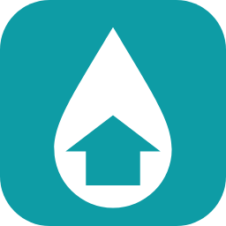

<p align="center">
  
</p>

# Domuse Irrigation

A Home Assistant custom integration for controlling irrigation pumps and watering schedules.

## Features

- **Sidebar panel** — dedicated configuration page in the HA sidebar
- **Pump management** — add any existing `switch.*` entity as an irrigation pump
- **Watering schedules** — weekday selection, start time (HH:MM:SS), and duration in seconds per pump
- **Manual control** — Lovelace card with per-pump toggle switches
- **Auto-scheduling** — HA turns the pump on/off automatically at the scheduled time

---

## Installation

### HACS (recommended)

1. Add this repository as a custom HACS integration repository.
2. Install **Domuse Irrigation** from HACS.
3. Restart Home Assistant.
4. Go to **Settings → Integrations → Add Integration** and search for **Domuse Irrigation**.

### Manual

1. Copy `custom_components/domuse_irrigation/` into your HA `config/custom_components/` folder.
2. Restart Home Assistant.
3. Go to **Settings → Integrations → Add Integration** and search for **Domuse Irrigation**.

---

## Configuration

After setup, click **Configure** on the integration card:

| Option | Description |
|--------|-------------|
| Show in sidebar | Adds an *Irrigation* entry to the HA sidebar navigation |

---

## Sidebar Panel

The panel has two tabs:

### Pumps tab

- Lists all configured pumps with live on/off state
- Toggle each pump manually from the panel
- Add a pump by selecting any existing `switch.*` entity
- Remove a pump (does not affect the underlying switch entity)

### Schedules tab

- Lists all watering schedules
- Create a schedule: choose a pump, select weekdays, set a start time (seconds precision), and a duration in seconds
- HA automatically turns the pump on at the scheduled time and off after the duration

---

## Lovelace Card

The integration auto-registers the card resource. Add it to any dashboard:

```yaml
type: custom:domuse-irrigation-card
title: Irrigation Control   # optional
```

| Key | Type | Default | Description |
|-----|------|---------|-------------|
| `title` | string | `Irrigation Control` | Card header title |

The card reads the pump list from the integration — no manual entity configuration needed.

---

## How schedules work

Schedules are stored in HA's `.storage/domuse_irrigation_data` JSON file.
At the scheduled time the integration:

1. Calls `switch.turn_on` on the pump entity
2. Waits for the configured duration (via HA's `async_call_later`)
3. Calls `switch.turn_off`

> **Note:** If HA restarts while a pump is running it will **not** be automatically stopped.